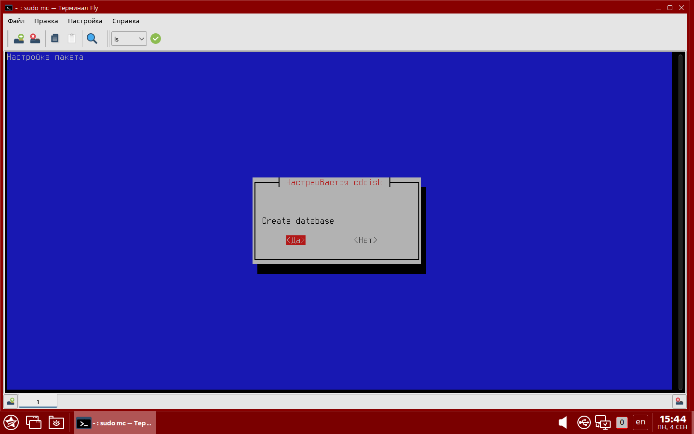
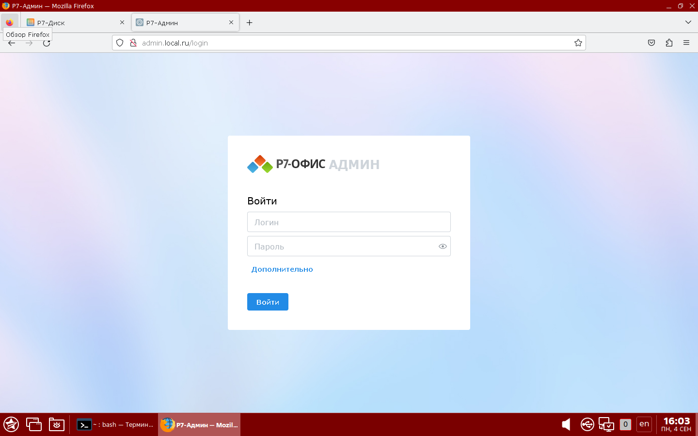

# RServer Astra Linux
## Оглавление

1. [Архитектура](#архитектура)
    - [Общий порядок взаимодействия](#общий-порядок-взаимодействия)
    - [Порядок работы пользователя с документом](#порядок-работы-пользователя-с-документом)
2. [Преимущества](#преимущества)
3. [Технологии](#технологии)
4. [Установка](#установка)
   - [Подтверждение установки](#подтверждение-установки)
6. [Контакты](#контакты)

## Архитектура

### Общий порядок взаимодействия
- **Web**: Веб-сервер для обработки клиентских запросов.
- **Document Server**: Отдельный сервер для редактирования документов.
- **API**: Программный интерфейс для взаимодействия между компонентами.
- **PostgreSQL**: БД для хранения данных документов и пользовательских данных.
- **RabbitMQ**: Брокер сообщений для асинхронного взаимодействия.
- **FileStorage**: REST API для доступа к файловому хранилищу.
- **Service Registry**: Реестр сервисов для управления микросервисами.
- **Search Server BsaSearch**: Поисковый сервер для индексации и поиска.
- **Processing**: Компонент для индексации данных.

### Порядок работы пользователя с документом
1. Пользователь открывает документ в веб-интерфейсе.
2. После проверки прав доступа, пользователю передается ссылка на файл.
3. Доступны два варианта сохранения: при закрытии документа и периодическое сохранение.

## Преимущества

- Горизонтальная масштабируемость
- Отказоустойчивость
- Использование безопасных и современных ОС
- Гибкость технологий
- Stateless архитектура
- Применение принципа CQRS

## Технологии

- **Frontend**: React
- **Backend**: Node.js, .NET Core
- **Database**: PostgreSQL
- **Message Broker**: RabbitMQ
- **Search Engine**: BsaSearch
- **OS**: Astra Linux 1.7, РЕД ОС 7.3

## Установка

Требования к окружению:
- Astra Linux 1.7 "Смоленск"

### Main Screen

Убедиться что соединение с сетью интернет стабильно.

- сделать исполняемым скрипт `install-web.sh` командой `chmod +x install-web.sh`
- запустить скрипт командой `./install-web.sh`
- на запрос пароля для `sudo` ввести его

Если требуется поддержка HTTPS, перед установкой скопируйте crt и key файлы в папку sslcert. Имя файла должно содержать название домена и расширение.
Например, для домена yandex.ru имена файлов долдны быть yandex.ru.crt и yandex.ru.key.

В процессе установки требуется ввод пользователя:
Если требуется выполнить чистую установку, то в диалоге
- Настраивается cddisk "Make clean install?": Выбрать Да (Yes)
Если не требуется выполнить чистую установку, то в диалоге
- Настраивается cddisk "Make clean install?": Выбрать Нет (No)

Для установки базы данных на локальный компьютер:
- Настраивается cddisk "Install postgresql on local pc?": Выбрать Да (Yes)

Для установки Document Server в локальной машине, в диалоге
- Настраивается cddisk "Install Document Server?": Выбрать Да (Yes)

- Настраивается cddisk "Enter Document Server secret:" ввести секретный ключ, выбрать *Ok*

- Настраивается r7-office-documentserver-ee "Database password:" ввести **saSA123$**, выбрать *Ok*

Если Document Server не будет установливаться в локальной машине, в диалоге
- Настраивается cddisk "Install Document Server?": Выбрать Нет (No)
- Настраивается cddisk "Document server URL:" ввести URL где установлен Document Server, выбрать *Ok*

- Настраивается cddisk "Document Server JWT key:" ввести секретный ключ установленого Document Server, выбрать *Ok*

Для установки CDDisk, в диалоге
- Настраивается cddisk "Install CDDisk api & web?": Выбрать Да (Yes)

- Настраивается cddisk "Choose database type": Выбрать postgresql

- Настраивается cddisk "Create database": Выбрать Да (Yes)

- Настраивается cddisk "Database host": ввести имя домена куда устанавливается база данных *Ok* (по-умолчанию *localhost*)

- Настраивается cddisk "Database port": ввести tcp порт базы данных *Ok* (по-умолчанию *5432*)

- Настраивается cddisk "Database user for create DB": ввести имя пользователя, под которым будет работать база данных *Ok* (по-умолчанию *postgres*)

- Настраивается cddisk "Database password:" два раза ввести **saSA123$** выбрать *Ok*

- Настраивается cddisk "The salt to be used during the key derivation process:" ввести ключ, который будет использоваться для генерации хэшей паролей *Ok* (по-умолчанию *Vskoproizvolny Salt par Chivreski_*)

- Настраивается cddisk "Make https access to site. Make https?": Выбрать Yes или No

- Настраивается cddisk "Domain name:" ввести имя домена куда устанавливается cddisk *Ok* (по-умолчанию *local.ru*)

Дождаться завершения установки

- Если установили https для проверки откройте https://cddisk.local.ru, если ввели домен отличный от дефолтного то https://cddisk.вашдомен, который ввели в переменную "Site domain"
- Если установили http для http://cddisk.local.ru, если ввели домен отличный от дефолтного то http://cddisk.вашдомен, который ввели в переменную "Site domain"

- Аналогично http(s)://admin.{вашдомен} http(s)://cdmail.{вашдомен} http(s)://calendar.{вашдомен}:

- Если авторизация не работает в браузере посмотреть ответ от api нажав кнопку F12, если 502 то выполнить команду sudo supervisorctl restart cddisk:*, если при выполнение возникли ошибки, то проверить логи /var/log/r7-office/
- Если в логах EACCES то выполнить команду chmod 755 /opt/r7-office, выполнить команду sudo supervisorctl restart cddisk:*, в случае успешного старта всех сервисов выполнить запрос по url https://cddisk.вашдомен/api/v1/version

### Проверка установки

После успешной установки, будет запущена проверка установки, для этого:
- Введите имя домена, указанное во время установки.

- Выберите тип установки: http или https.

Выполняется проверка установленных сервисов и программ, записей в файле /etc/hosts, проверка подключения к установленным сайтам.

Будут выведены пути, где располагаются логи установленных сервисов и программ.

В случае успешной установки будет выведена надпись "Установка прошла успешно" и информация как получиь доступ к установленным сайтам.

Если установка завершилась с ошибкой, будет выведена надпись "Ошибка" и информация для связи с разработчиками.

В текущем каталоге сохраняется лог установки в файл logfile.txt.
В случае возникновения ошибок, отправьте лог файл по почте в поддержку.

## Контакты

Если у вас есть вопросы или предложения, пожалуйста, свяжитесь с нами через телеграм support@r7-office.ru.
