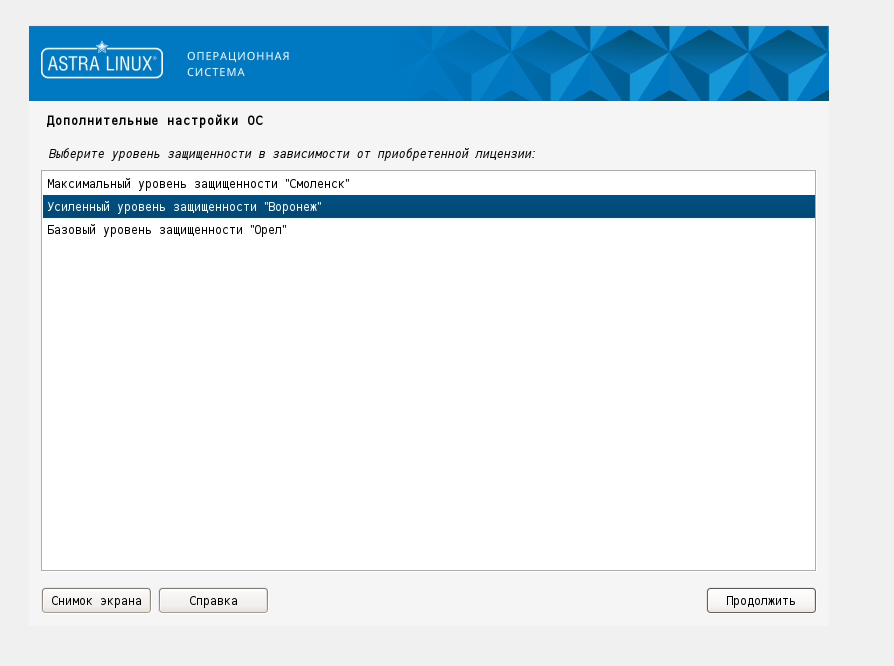

# RServer RedOS
## Оглавление

1. [Архитектура](#архитектура)
    - [Общий порядок взаимодействия](#общий-порядок-взаимодействия)
    - [Порядок работы пользователя с документом](#порядок-работы-пользователя-с-документом)
2. [Преимущества](#преимущества)
3. [Технологии](#технологии)
4. [Установка](#установка)
   - [Подтверждение установки](#подтверждение-установки)
6. [Контакты](#контакты)

## Архитектура

### Общий порядок взаимодействия
- **Web**: Веб-сервер для обработки клиентских запросов.
- **Document Server**: Отдельный сервер для редактирования документов.
- **API**: Программный интерфейс для взаимодействия между компонентами.
- **PostgreSQL**: БД для хранения данных документов и пользовательских данных.
- **RabbitMQ**: Брокер сообщений для асинхронного взаимодействия.
- **FileStorage**: REST API для доступа к файловому хранилищу.
- **Service Registry**: Реестр сервисов для управления микросервисами.
- **Search Server BsaSearch**: Поисковый сервер для индексации и поиска.
- **Processing**: Компонент для индексации данных.

### Порядок работы пользователя с документом
1. Пользователь открывает документ в веб-интерфейсе.
2. После проверки прав доступа, пользователю передается ссылка на файл.
3. Доступны два варианта сохранения: при закрытии документа и периодическое сохранение.

## Преимущества

- Горизонтальная масштабируемость
- Отказоустойчивость
- Использование безопасных и современных ОС
- Гибкость технологий
- Stateless архитектура
- Применение принципа CQRS

## Технологии

- **Frontend**: React
- **Backend**: Node.js, .NET Core
- **Database**: PostgreSQL
- **Message Broker**: RabbitMQ
- **Search Engine**: BsaSearch
- **OS**: Astra Linux 1.7, РЕД ОС 7.3

## Установка

Требования к окружению:
- РЕД ОС 7.3

### Main Screen

Убедиться что соединение с сетью интернет стабильно.

### Подтверждение установки

После успешной установки, вы должны увидеть следующее сообщение:

Если данного сообщения нет, то скопируйте из терминала сообщения в процессе установки и сохраните в файл.
Файл загрузите на ресурс https://tmpfiles.org и отправьте 

## Контакты

Если у вас есть вопросы или предложения, пожалуйста, свяжитесь с нами через телеграм @lex_ufa.
